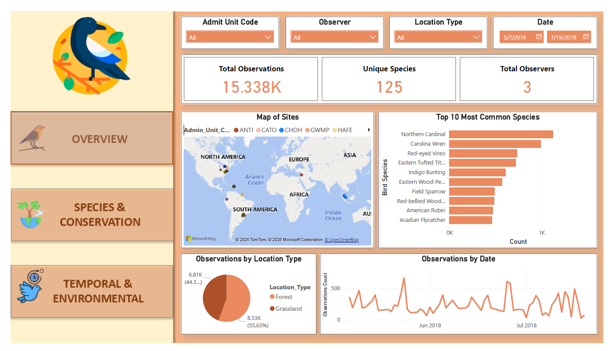
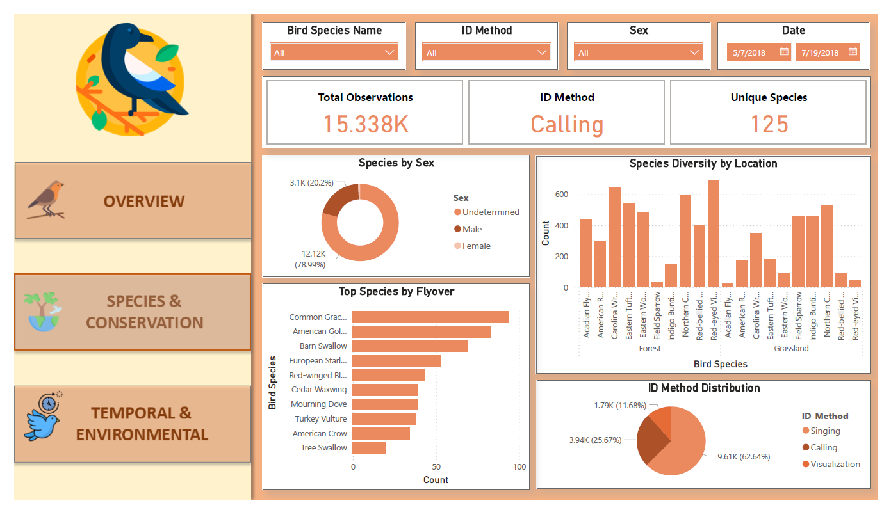
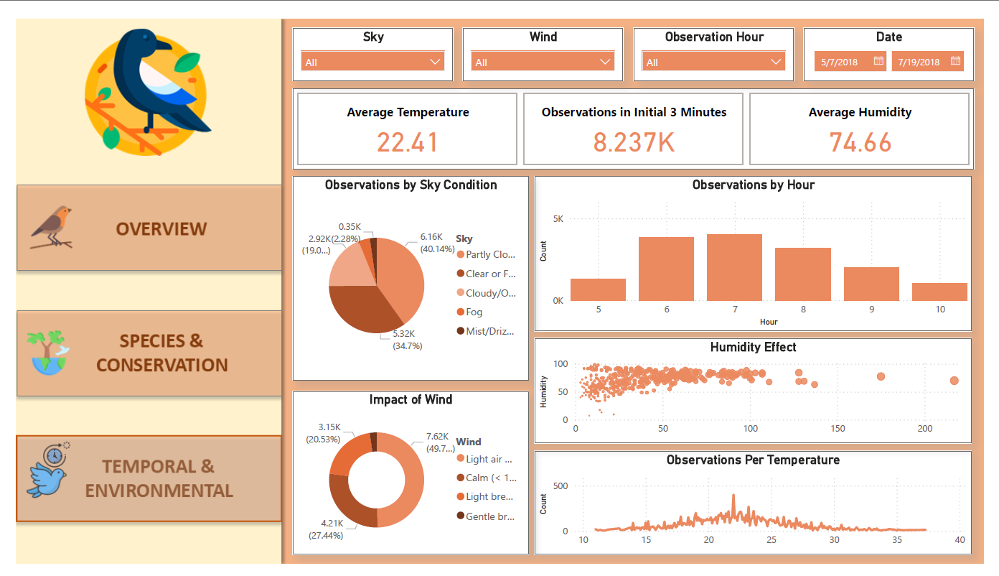

# 🦅 **BIRD SPECIES OBSERVATION ANALYSIS** 🔭

  

This project delivers a comprehensive end-to-end data analysis of bird species distribution across forest and grassland habitats using Python and Power BI. It uncovers insights into species diversity, habitat preferences, observer activity, and environmental influences.

---

## 📌 Project Objectives

* Study bird species distribution and diversity across habitats
* Identify habitat preferences and environmental factors influencing bird presence
* Determine peak observation times for fieldwork and eco-tourism
* Highlight dominant and rare species for targeted conservation efforts
* Recognize top observers to motivate accurate and consistent data collection
* Provide actionable insights for biodiversity conservation and eco-tourism planning

---

## 🛠️ Tools & Technologies Used

🐍 **Python (Pandas, NumPy, Matplotlib, Seaborn, Missingno)** – Data cleaning, preprocessing, and exploratory data analysis.

📊 **Power BI** – 3-page interactive dashboard featuring slicers, KPIs, and visual storytelling.

📁 **Excel** – Processing forest and grassland bird monitoring datasets across multiple sites.

---

## 🗃️ Data Workflow

### 1. Data Loading

* Combined **Forest** and **Grassland** Excel sheets into pandas DataFrames
* Explored structure, duplicates, and missing values
* Mapped **Admin Unit Codes** (e.g., ANTI, CATO, CHOH) to ecological sites

### 2. Data Preprocessing

* ✅ Dropped low-utility columns (e.g., `Sub_Unit_Code`)
* ✅ Imputed missing values (`Unknown`, `Undetermined`, or `Mode`)
* ✅ Cleaned and standardized time fields into `Observation_Hour`
* ✅ Converted categorical columns to efficient datatypes
* ✅ Removed duplicates to ensure integrity
* ✅ Saved cleaned dataset as `Bird_Monitoring_Clean_Merged_dataset.csv`

### 3. Exploratory Data Analysis (EDA)

* Habitat & sex distribution
* Top 10 observed bird species
* Distance distribution of sightings
* Observer activity & recognition
* Hourly & temporal observation trends
* Environmental influences (temperature, humidity, sky, wind)

---

## 📊 Dashboard Overview (Power BI)

The **3-page interactive dashboard** visualizes key biodiversity and observation insights:

### 📈 Page 1: Overview

* **KPIs**: Total Observations, Unique Species, Total Observers
* **Visuals**: Map of sites, Top 10 species, Observations by location type & time

### 🐦 Page 2: Species & Conservation

* **KPIs**: Unique Species, Identification Methods, Sex Distribution
* **Visuals**: Species diversity across habitats, ID method distribution, Top species by flyover

### 🌍 Page 3: Temporal & Environmental

* **KPIs**: Avg. Temperature, Avg. Humidity, Initial 3-Minute Observations
* **Visuals**: Observation trends by hour, sky condition, wind distribution, humidity vs distance

---

## 🔎 Key Insights

### 🌱 Habitat & Biodiversity

* Forests accounted for **55.6%** of observations; Grasslands **44.4%**
* Dominant species: **Northern Cardinal** & **Carolina Wren**
* Many species showed strong habitat preference (e.g., Red-eyed Vireo in forests)

### ⏰ Temporal Patterns

* Bird activity peaked between **6–7 AM**
* Grassland activity more consistent throughout the morning

### 👥 Observer Insights

* **Elizabeth Oswald** recorded the highest number of observations
* Observers contributed more in forests than in grasslands

### 🌦 Environmental Trends

* Most sightings occurred at \~**22°C**, high humidity, and partly cloudy skies
* Light breezes (1–3 mph) dominated wind conditions
* Sex was undetermined in **79%** of cases, suggesting training gaps

---
## ✅ Recommendations

🔍 **Improve Data Quality** – Reduce undetermined sex entries via better observer training.

🦜 **Diversify ID Methods** – Move beyond just singing; incorporate visual identification and call-back methods.

📏 **Standardize Records** – Enforce strict distance recording to eliminate "Unknown" entries.

⏰ **Strategic Fieldwork** – Conduct primary observations between **6:00 AM – 8:00 AM** for peak activity.

🌲 **Habitat Prioritization** – Maintain focus on forest habitats while increasing monitoring in underreported grasslands.

🏆 **Support Observers** – Recognize and incentivize top-performing observers to maintain high-quality data collection.

☁️ **Eco-Tourism Alignment** – Schedule activities during optimal weather windows (**~22°C, partly cloudy, light breeze**).

---

## 🎯 Solution to Business Objective

🌿 **Prioritize Habitat-Specific Strategies** – Focus more monitoring and conservation in forests, while strengthening grassland biodiversity programs to balance efforts.

📉 **Enhance Data Collection Quality** – Train observers to improve sex determination and accurately record observation distances to close current data gaps.

🌅 **Leverage Peak Observation Times** – Schedule eco-tourism activities and research during early morning hours (6–7 AM) to maximize sightings.

🛡️ **Target Conservation for Rare Species** – Create special monitoring programs for low-observation species to prevent population decline.

🤝 **Empower Top Observers** – Recognize and incentivize leading contributors to mentor others and improve team-wide performance.

🌡️ **Integrate Environmental Tracking** – Use insights on wind, sky, and disturbance levels to plan optimal birdwatching and research conditions.

📅 **Diversify Observation Coverage** – Increase monitoring in varied seasons and times to capture a more complete picture of bird diversity.

💰 **Promote Eco-Tourism Marketing** – Highlight popular species and high-sighting times to attract enthusiasts and boost tourism revenue.

🏢 **Collaborate with Conservation Bodies** – Partner with NGOs and research institutions to implement habitat-specific conservation measures.

---

## 💡 Strategic Businesss Suggestions

Derived from bird diversity analysis across forest and grassland ecosystems:

#### 🦅 Wildlife Conservation
* **Focus on High-Risk Zones**: Direct funding toward plots containing **PIF Watchlist** and **Regional Stewardship** species.
* **Micro-Habitat Creation**: Develop tailored environments for rare species identified in the dataset to encourage population growth.

#### 🚜 Land Management & Restoration
* **Species-Preference Data**: Align restoration plans with specific vegetation needs (e.g., dense undergrowth vs. open grasslands).
* **Disturbance Reduction**: Implement buffer zones in high-disturbance areas to allow for biodiversity recovery.

#### 🎒 Eco-Tourism Development
* **Branded Birding Trails**: Designate biodiversity hotspots as official eco-tourism destinations.
* **Event Planning**: Schedule guided tours during peak activity months (April–June) to ensure the best tourist experience.

#### 🌾 Sustainable Agriculture
* **Habitat-Friendly Practices**: Encourage no-spray zones and native buffers in agricultural areas bordering bird habitats.
* **Impact Monitoring**: Use disturbance analysis to adapt agricultural practices based on nearby bird population health.

#### 🏛️ Policy & Governance
* **Evidence-Based Zoning**: Use spatial biodiversity heatmaps to advocate for new protected conservation zones.
* **Long-Term Monitoring**: Standardize protocols for repeated visits, as consistency significantly increases species detection.

#### 🔬 Research & Monitoring
* **Continuous Collection**: Invest in long-term ecological monitoring to track trends over several years.
* **Climate Resilience**: Integrate temperature and wind analysis into broader climate impact assessments for local wildlife.

### 🚀 Overall Strategic Direction
* **Centralized Dashboard**: Integrate this data into a real-time biodiversity dashboard for immediate decision-making.
* **Cross-Sector Collaboration**: Foster partnerships between **research institutions, tourism boards, and agricultural agencies** to co-develop region-specific strategies.

---
## 📌 Conclusion

The Bird Species Observation Analysis project demonstrates how raw observational data can be transformed into **valuable biodiversity insights**. From species diversity to environmental dependencies, the findings inform conservation strategies, optimize eco-tourism activities, and highlight opportunities for better data collection practices. The **Power BI dashboard** enhances storytelling, making insights actionable for conservationists, researchers, and policymakers.

---
